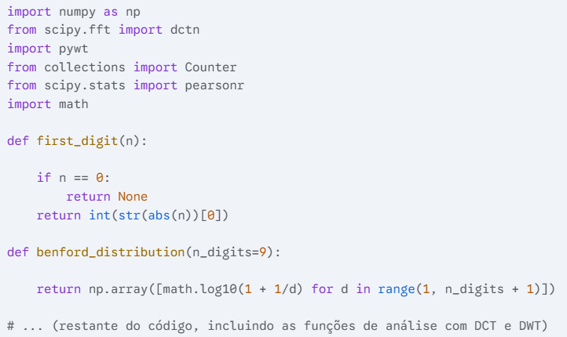
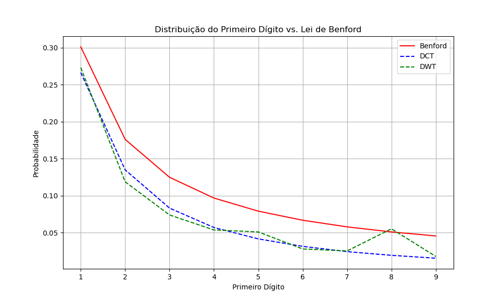
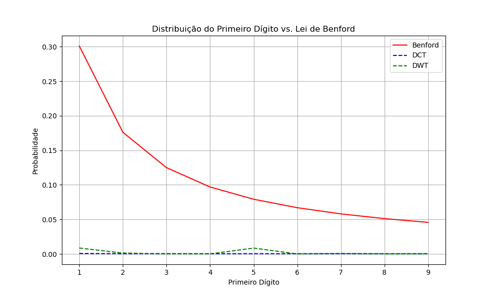

# Análise de Benford em Imagens

[](https://www.python.org/downloads/)
[](https://opensource.org/licenses/MIT)


Apresento neste repositório uma ferramenta Python para analisar imagens digitais e verificar sua conformidade com a Lei de Benford, utilizando a Transformada Discreta de Coseno (DCT) ou a Transformada Wavelet Discreta (DWT) para decompor a imagem em componentes de frequência. 

Esta análise pode ser utilizada para detectar manipulações, identificar características de imagens geradas por inteligência artificial ou para caracterizar propriedades intrínsecas de diferentes tipos de imagens.

<br>

## Sobre a Lei de Benford

<p align="center">
  
</p>

A Lei de Benford, também conhecida como Lei do Primeiro Dígito, é um fenômeno estatístico em que em muitos conjuntos de dados numéricos do mundo real, o primeiro dígito significativo segue uma distribuição logarítmica específica:

- O dígito 1 aparece como primeiro dígito em cerca de 30.1% das vezes
- O dígito 2 aparece como primeiro dígito em cerca de 17.6% das vezes
- O dígito 3 aparece como primeiro dígito em cerca de 12.5% das vezes
- ...e assim por diante, com frequências menores para dígitos maiores

Esta lei tem aplicações em auditoria financeira, detecção de fraudes, análise científica e, como explorado neste projeto, na análise de propriedades estatísticas de imagens digitais através da análise dos coeficientes de frequência obtidos por DCT ou DWT.

<br>

## Como a Lei de Benford se Aplica a Imagens (via Transformações de Frequência)

Neste projeto, a análise da Lei de Benford é aplicada aos **coeficientes de frequência** obtidos através da **Transformada Discreta de Coseno (DCT)** ou da **Transformada Wavelet Discreta (DWT)** da imagem. 

A ideia é que a distribuição dos primeiros dígitos desses coeficientes possa revelar padrões característicos de imagens naturais versus manipuladas ou geradas artificialmente.

O projeto implementa um algoritmo para:

1. **Decompor a imagem:** Aplicar DCT ou DWT para obter os coeficientes de frequência.
2. **Extrair os primeiros dígitos:** Obter o primeiro dígito significativo dos coeficientes de cada subband (no caso da DWT).
3. **Calcular a distribuição observada:** Determinar a frequência de cada primeiro dígito nos coeficientes.
4. **Comparar com a distribuição teórica:** Utilizar métricas como Divergência de Kullback-Leibler, Distância de Bhattacharyya e Coeficiente de Correlação de Pearson para quantificar a similaridade entre a distribuição observada e a distribuição de Benford.
5. **Visualizar os resultados (opcional):** Plotar as distribuições para comparação visual.

<br>

## Instalação

```bash
# Clonar o repositório
git clone [https://github.com/deldotore-r/benford_01.git](https://github.com/deldotore-r/benford_01.git)
cd benford_01

# Instalar dependências
pip install -r requirements.txt
```

<br>

## Implementação

O código-fonte principal implementa os seguintes passos:

- **Decomposição da Imagem:** Utiliza `scipy.fft.dctn` para a Transformada Discreta de Coseno (DCT) e `pywt.wavedec2` para a Transformada Wavelet Discreta (DWT).
- **Extração do Primeiro Dígito:** A função `first_digit(n)` extrai o primeiro dígito significativo de um número.
- **Cálculo da Distribuição:** A função `calculate_distribution(digits)` calcula a frequência dos primeiros dígitos observados.
- **Distribuição Teórica de Benford:** A função `benford_distribution()` gera a distribuição teórica esperada pela Lei de Benford.
- **Métricas de Conformidade:**
    - **Divergência de Kullback-Leibler:** Calculada utilizando funcionalidades da biblioteca `numpy`.
    - **Distância de Bhattacharyya:** Implementada na função `bhattacharyya_distance(p, q)`.
    - **Coeficiente de Correlação de Pearson:** Calculado utilizando a função `pearsonr` do módulo `scipy.stats`.
- **Análise Principal:** A função `analyze_image_benford(image_path, transform_type='DCT', wavelet='haar', level=1)` coordena a execução de todas as etapas da análise para uma dada imagem e tipo de transformação.

<br>

## Trecho inicial do código principal:

<p align="left">
  
</p>

O código completo está disponível [neste Gist](https://gist.github.com/deldotore-r/aed560d2e228194200161b042ef37bdb).

<br>

## Como Usar

1.  **Clone o repositório:**
    ```bash
    git clone [https://github.com/deldotore-r/benford_01.git](https://github.com/deldotore-r/benford_01.git)
    ```

2.  **Navegue até o diretório:**
    ```bash
    cd benford_01
    ```

3.  **Instale as dependências:**
    ```bash
    pip install -r requirements.txt
    ```

4.  **Execute o script:**

    ```bash
    python benford_image_analysis.py sua_imagem.png
    ```

    Substitua `sua_imagem.png` pelo caminho da imagem que você deseja analisar. O script imprimirá os resultados da análise para DCT e DWT.

    Você pode modificar o script para analisar diferentes imagens, alterar o tipo de transformada (`DCT` ou `DWT`), o tipo de wavelet (para DWT) e o nível de decomposição.

    

<br>

## Exemplo de resultado de análise de imagem real:

<p align="left">
  
</p>

<br>

## Exemplo de resultado de análise de imagem criada por IA:

<p align="left">
  
</p>

<br>

## Aplicações

Este projeto pode ser útil para:

-   **Detecção de manipulação de imagens:** Desvios significativos da Lei de Benford nos coeficientes de frequência podem indicar adulteração.
-   **Análise forense de imagens digitais:** Fornece uma ferramenta quantitativa para avaliar a integridade de imagens.
-   **Caracterização de imagens geradas por IA:** Imagens sintéticas podem apresentar distribuições de primeiros dígitos diferentes das imagens naturais.
-   **Estudo de propriedades estatísticas de imagens:** Investigar como diferentes transformações e tipos de imagens se comportam em relação à Lei de Benford.
-   **Aprendizado em processamento de imagens e análise estatística.**

