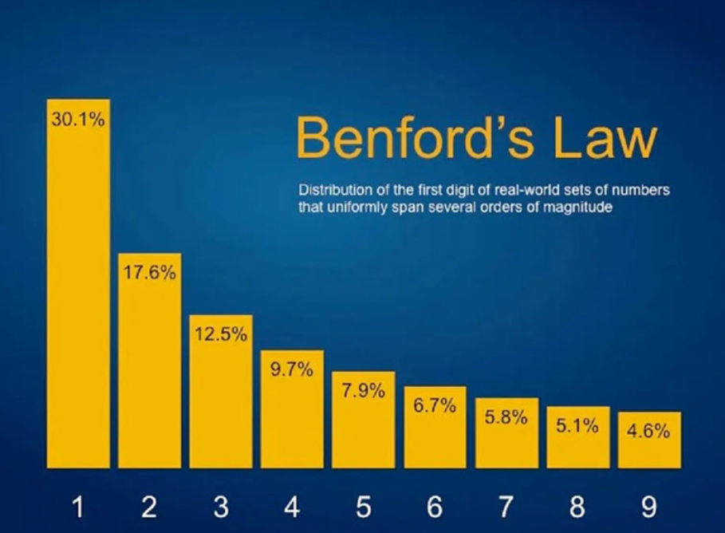

# Análise de Benford em Imagens


Apresento neste repositório uma ferramenta Python para analisar imagens digitais e verificar sua conformidade com a Lei de Benford, que pode ser utilizada para detectar manipulações ou para caracterizar propriedades intrínsecas das imagens.

## Sobre a Lei de Benford

<p align="center">
  
</p>

A Lei de Benford, também conhecida como Lei do Primeiro Dígito, é um fenômeno estatístico onde em muitos conjuntos de dados numéricos do mundo real, o primeiro dígito significativo segue uma distribuição logarítmica específica:

- O dígito 1 aparece como primeiro dígito em cerca de 30.1% das vezes
- O dígito 2 aparece como primeiro dígito em cerca de 17.6% das vezes
- O dígito 3 aparece como primeiro dígito em cerca de 12.5% das vezes
- ...e assim por diante, com frequências menores para dígitos maiores

Esta lei tem aplicações em auditoria financeira, detecção de fraudes, análise científica e, como explorado neste projeto, na análise de propriedades estatísticas de imagens digitais.

## Como a Lei de Benford se Aplica a Imagens

Em imagens digitais, podemos analisar os valores dos pixels, coeficientes de transformadas (como DCT ou wavelets), gradientes, ou outros atributos extraídos da imagem. Curiosamente, imagens naturais não manipuladas tendem a seguir a Lei de Benford para certos parâmetros, enquanto imagens manipuladas ou geradas artificialmente podem apresentar desvios significativos.

Este projeto implementa um algoritmo para:

1. Extrair características relevantes da imagem;
2. Analisar a distribuição do primeiro dígito;
3. Comparar com a distribuição esperada pela Lei de Benford;
4. Visualizar e quantificar os resultados.

## Instalação

```bash
# Clonar o repositório
git clone https://github.com/deldotore-r/benford_01.git
cd benford_01 

# Instalar dependências
pip install -r requirements.txt
```

## Como Usar

### Exemplo Básico

```python
from benford_image import BenfordAnalyzer

# Inicializar o analisador
analyzer = BenfordAnalyzer()

# Analisar uma única imagem
result = analyzer.analyze_image("caminho/para/imagem.jpg")

# Visualizar resultados
analyzer.plot_distribution(result)

# Verificar conformidade com a Lei de Benford
conformity_score = analyzer.compute_conformity(result)
print(f"Índice de conformidade: {conformity_score}")
```

### Análise em Lote

```python
# Analisar um diretório de imagens
results = analyzer.analyze_directory("caminho/para/diretorio")

# Comparar resultados entre imagens originais e manipuladas
analyzer.compare_groups(results["original"], results["manipulated"])
```

## Exemplos de Resultados

Abaixo estão alguns exemplos de análises conduzidas com esta ferramenta:

### Imagem Natural Não Manipulada


*Observe como a distribuição (barras azuis) segue de perto a Lei de Benford esperada (linha vermelha).*

### Imagem Manipulada


*Note o desvio significativo da Lei de Benford, particularmente nos dígitos 1, 2 e 9.*

## Implementação

O código-fonte principal implementa os seguintes componentes:

1. **Extração de Características**: Múltiplos métodos para extrair dados numericamente relevantes das imagens
2. **Análise do Primeiro Dígito**: Algoritmo eficiente para calcular a distribuição do primeiro dígito significativo
3. **Métricas de Conformidade**: Implementação de chi-quadrado, distância de Kullback-Leibler e outras métricas
4. **Visualização**: Funções para gerar gráficos informativos dos resultados

Trecho inicial do código principal:

```python
import numpy as np
import cv2
import matplotlib.pyplot as plt
from scipy import stats
import os
from tqdm import tqdm

class BenfordAnalyzer:
    def __init__(self, feature_type='dct', significance_level=0.05):
        """
        Inicializa o analisador de Benford para imagens
        
        Parâmetros:
        -----------
        feature_type : str
            Tipo de característica a extrair ('dct', 'gradient', 'wavelet', 'pixel')
        significance_level : float
            Nível de significância para testes estatísticos
        """
        self.feature_type = feature_type
        self.significance_level = significance_level
        
        # Distribuição esperada pela Lei de Benford
        self.benford_expected = np.array([0] + [np.log10(1 + 1/d) for d in range(1, 10)])
        
    # ... (código continua)
```

O código completo está disponível [neste Gist](https://gist.github.com/seu-usuario/link-para-seu-gist).

## Aplicações

Este projeto pode ser útil para:

- Identificação de imagens manipuladas digitalmente
- Estudo de propriedades estatísticas de diferentes tipos de imagens
- Aprendizado sobre processamento de imagens e estatística aplicada
- Detecção de imagens geradas por IA versus fotografias reais
- Análise forense de imagens digitais

## Contribuindo

Contribuições são bem-vindas! Sinta-se à vontade para abrir issues ou enviar pull requests.

1. Fork o projeto
2. Crie sua branch (`git checkout -b feature/sua-feature`)
3. Commit suas alterações (`git commit -m 'Adiciona nova feature'`)
4. Push para a branch (`git push origin feature/sua-feature`)
5. Abra um Pull Request

## Licença

Este projeto está licenciado sob a licença MIT - veja o arquivo [LICENSE](LICENSE) para detalhes.

## Citação

Se você utilizar este código em trabalhos acadêmicos, por favor cite:

```
@software{benford_image_analysis,
  author = {Seu Nome},
  title = {Análise de Benford em Imagens: Detecção de Manipulações e Caracterização Estatística},
  year = {2025},
  url = {https://github.com/seu-usuario/benford-image-analysis}
}
```

## Contato

[Seu Nome](mailto:seu-email@exemplo.com)

---

Desenvolvido com ❤️ por [Seu Nome]
